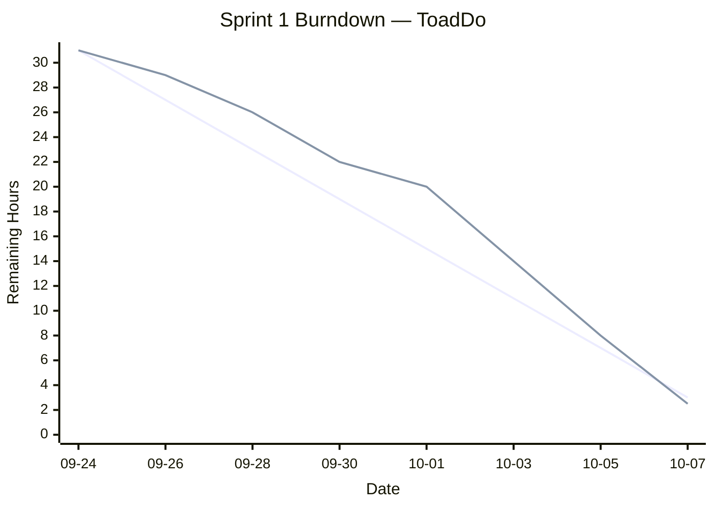

# Sprint 1 Deliverables (9/24–10/7)

**Project:** *ToadDo* — a gamified to‑do app where every completed task evolves your pet toad. Ribbit‑rewards, XP, and a gentle "croak" reminder if you procrastinate.

**Team:**
- **Product Owner:** Alex Byte  
- **Scrum Master:** Priya Loop  
- **Developers:** Diego Patch, Mina Stack

---

## 1. Scrum Roles
- **Product Owner:** Alex Byte  
  Owns backlog, prioritization, stakeholder comms.  
- **Scrum Master:** Priya Loop  
  Facilitates ceremonies, removes impediments, defends amphibian puns.  
- **Developers:** Diego Patch, Mina Stack  
  Full‑stack: mobile/web UI, backend API, tests, CI.

---

## 2. Meeting Schedule
| Meeting               | Date       | Time  | Notes |
|-----------------------|------------|-------|-------|
| Sprint Planning       | 2025-09-24 | 10:00 | Scope Sprint 1, define goal, estimate stories |
| Daily Scrum #1        | 2025-09-25 | 10:00 | Standup (q1/q2/q3) |
| Daily Scrum #2        | 2025-09-27 | 10:00 | Standup |
| Daily Scrum #3        | 2025-09-29 | 10:00 | Standup |
| Daily Scrum #4        | 2025-10-01 | 10:00 | Standup (mid‑sprint snapshot) |
| Daily Scrum #5        | 2025-10-03 | 10:00 | Standup |
| Daily Scrum #6        | 2025-10-06 | 10:00 | Standup |
| Sprint Retrospective  | 2025-10-07 | 16:00 | 1‑page brief captured below |

---

## 3. Start‑of‑Sprint Snapshots (post‑Planning)

### 3.1 Product Backlog (start)

| ID  | User Story & Acceptance Criteria (abridged) | Hours | Notes |
|-----|---------------------------------------------|--------|-------|
| P1  | **As a user,** I can create tasks with title, due date, and priority **so that** I can track work. **AC:** title required; due date optional; tasks persist. | 8 | Core CRUD |
| P2  | **As a user,** completing a task gives my toad XP and triggers an animation. **AC:** XP increments; animation < 2s; no page reload. | 5 | Gamification |
| P3  | **As a user,** I can see a dashboard: total tasks, completed today, XP to next evolution. **AC:** numbers correct; responsive on mobile. | 5 | UI panel |
| P4  | **As a user,** I get a gentle croak reminder if a task is overdue. **AC:** once per day per task; user can snooze. | 8 | Notifications |
| P5  | **As a user,** my toad evolves at XP thresholds (Lv1→Lv2: 50 XP; Lv2→Lv3: 150 XP). **AC:** level calc; badge shown. | 5 | Leveling |
| P6  | **As DevOps,** CI runs tests on PR and blocks merge on failure. **AC:** GitHub Actions; unit tests run; status required. | 5 | CI baseline |
| P7  | **As a user,** I can filter tasks by status and priority. **AC:** multi‑filter; persists in URL query. | 3 | Nice‑to‑have |
| P8  | **As a user,** dark mode toggles and persists. **AC:** system pref by default; toggle in header. | 3 | Delight |

**Total backlog points (start):** 42

### 3.2 Sprint Goal
> **Deliver a usable MVP** where users can create/complete tasks and see their toad gain XP, with a basic dashboard and CI in place.

### 3.3 Sprint Backlog (start)
> Committed scope for 4‑person team (~30–32 hours target load).

| ID  | Selected Story | PHours | Owner | Status (start) |
|-----|----------------|--------|-------|----------------|
| P1  | Task CRUD (create/list/complete) | 8 | Diego | Not started |
| P2  | XP on complete + animation | 5 | Mina | Not started |
| P3  | Dashboard metrics panel | 5 | Alex | Not started |
| P5  | Level thresholds + badge | 5 | Mina | Not started |
| P6  | CI: GH Actions + unit tests | 5 | Priya | Not started |
| P7  | Filter by status/priority | 3 | Diego | Not started |

**Committed hours:** 31

---

## 4. Mid‑Sprint Snapshot (10/1)

### 4.1 Sprint Backlog (midpoint)
| ID  | Selected Story | Hours | Owner | Status (mid) | Notes |
|-----|----------------|--------|-------|--------------|-------|
| P1  | Task CRUD | 8 | Diego | **In Progress** (backend done; UI wiring 50%) | Found bug with due‑date parsing |
| P2  | XP + animation | 5 | Mina | **In Review** | Lottie animation added; perf OK |
| P3  | Dashboard | 5 | Alex | **In Progress** (metrics accurate; needs styling) | Added unit tests for counts |
| P5  | Level thresholds | 5 | Mina | **Blocked** (depends on P2 merge) | Waiting on XP events |
| P6  | CI | 5 | Priya | **Done** | Tests on PR; branch protection enabled |
| P7  | Filters | 3 | Diego | **Not Started** | Slated after P1 UI |

**Mid‑sprint changes:**
- CI (P6) finished early, caught 2 test regressions.  
- XP animation (P2) flagged as large Lottie; compressed asset.  
- Discovered date‑parsing issue on Safari (fix in P1 subtask).

---

## 5. End‑of‑Sprint Snapshots

### 5.1 Product Backlog (end)
| ID  | Story | Hours | Status (end) | Notes |
|-----|-------|--------|--------------|-------|
| P1  | Task CRUD | 8 | **Done** | CRUD + complete toggle + persistence |
| P2  | XP + animation | 5 | **Done** | 60fps on mobile; accessible fallback |
| P3  | Dashboard panel | 5 | **Done** | Mobile‑responsive; numbers verified |
| P4  | Overdue croak reminders | 8 | **Not Started** | Deferred to Sprint 2 |
| P5  | Level thresholds + badge | 5 | **Done** | Lv1→2 (50), Lv2→3 (150) |
| P6  | CI on PR | 5 | **Done** | Required checks on main |
| P7  | Filters | 3 | **In Progress (50%)** | Status filter done; priority pending |
| P8  | Dark mode | 3 | **Not Started** | Backlog |

**Remaining backlog after Sprint 1:** P4, P7 (½), P8  
**Delivered hours:** 28.5 (counting P7 at 50%)

### 5.2 Sprint Backlog (end)
| ID  | Story | Hours | Owner | Status (end) |
|-----|-------|--------|-------|--------------|
| P1  | Task CRUD | 8 | Diego | **Done** |
| P2  | XP + animation | 5 | Mina | **Done** |
| P3  | Dashboard | 5 | Alex | **Done** |
| P5  | Level thresholds | 5 | Mina | **Done** |
| P6  | CI | 5 | Priya | **Done** |
| P7  | Filters | 3 | Diego | **In Progress (50%)** |

### 5.3 Burndown Chart (full sprint)
> Ideal vs. actual remaining hours. Scope stayed constant.

---

## 6. One‑Page Retrospective (≈1 page)

### What went well
- **Clear Sprint Goal** anchored decisions; easy to say "not now" to P4/P8.
- **CI early** (P6) paid off: prevented two regressions from merging.
- **Small vertical slices** (CRUD → XP → dashboard) enabled visible progress and frequent demos.

### What didn’t go well / impediments
- **Asset performance:** First animation file was heavy (2.3MB). We lost ~0.5 day optimizing.  
- **Date parsing** differed across browsers; added polyfill and tests.  
- **Filter story (P7)** was underestimated; UI state sync with URL took longer.

### Improvements for next sprint (specific & actionable)
1. **Definition of Ready**: UI stories must include routing/state persistence requirements when filters/URL are involved.  
2. **Perf budget**: Cap individual asset size to ≤300KB unless pre‑approved. Add a CI check for asset sizes.  
3. **Cross‑browser checklist**: Sanity tests on Chrome/Safari/Firefox for any date/time feature before PR review.

### Key learnings
- Shipping CI early accelerates everything else.  
- Animations add delight, but only if they’re lightweight and accessible.  
- URL‑driven UI states are deceptively complex; plan for testing and docs.

---

